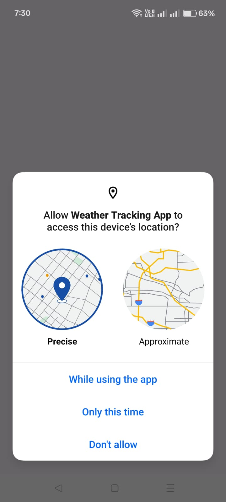
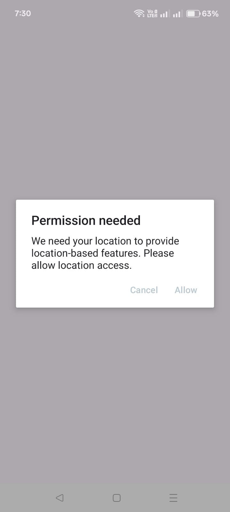
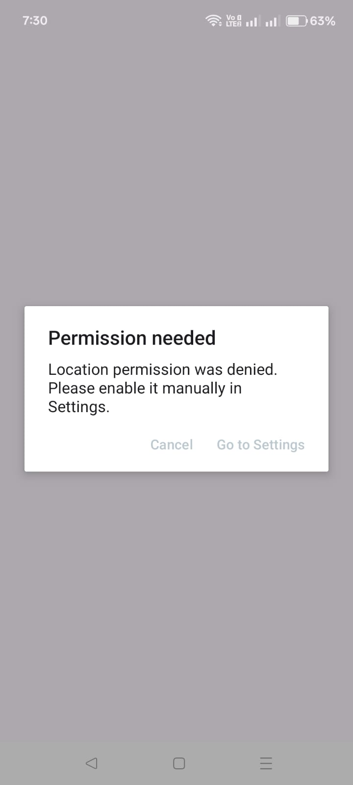
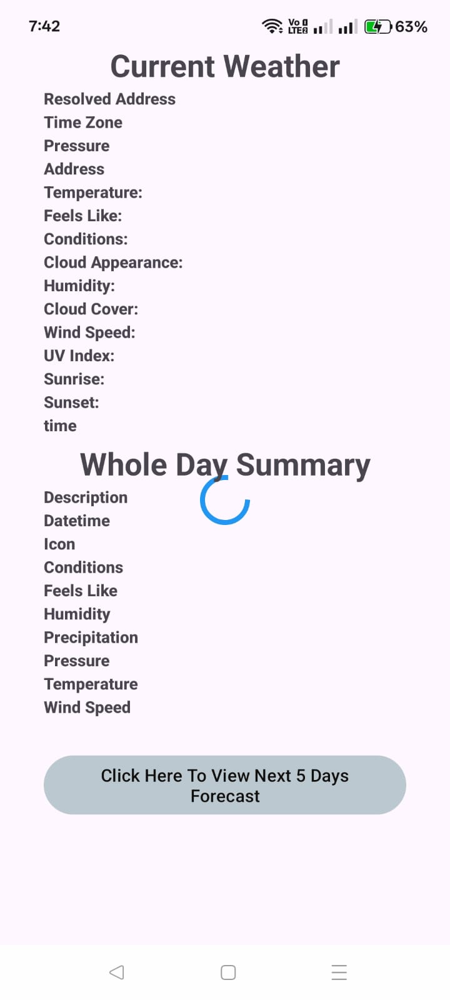
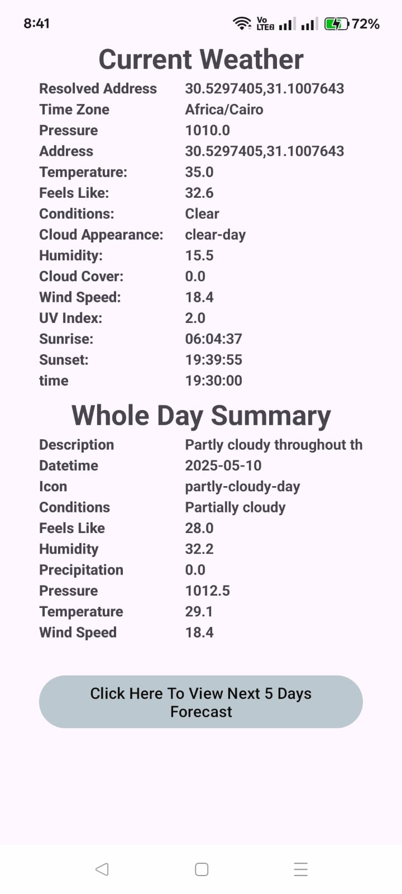
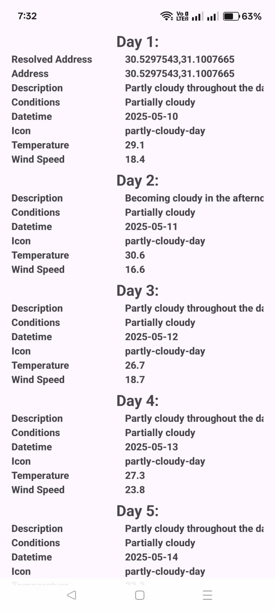
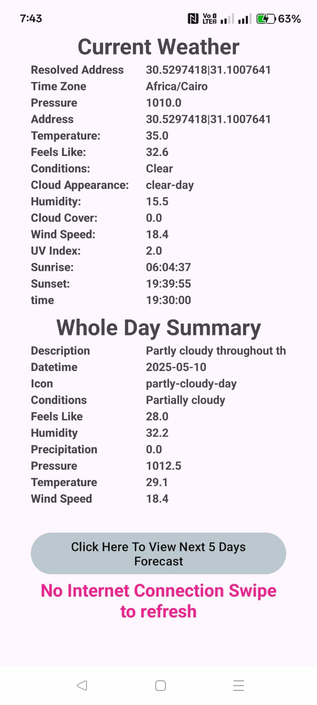
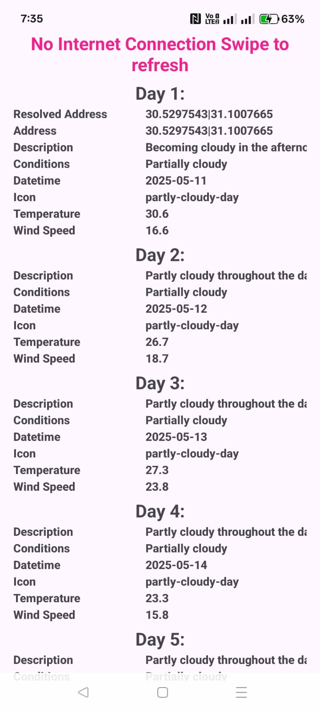

# 🌤️ Weather App

This is a multilingual weather app supporting **Arabic** and **English**.  
It follows clean architecture principles, S.O.L.I.D principles and integrates patterns to ensure a scalable, maintainable, and testable codebase.

---

## 🏗️ App Architecture

The app is built using the **Google-recommended architecture**:  
- **Data Layer → Domain Layer → Presentation Layer**  
- In the Presentation Layer, the **MVI (Model-View-Intent)** pattern is implemented.

---

## 💡 Design Patterns Used

- **Delegation Pattern** → To add modular functionalities to the UI.
- **Observer–Subscriber Pattern** → Used between UseCases, ViewModel, and UI (without relying on LiveData or Flows).
- **Decorator Pattern** → Applied in the BaseFragment, where common behaviors are defined and concrete fragments extend them with specific behaviors.
- **Singleton Pattern** → Ensures a single instance of local and remote data sources is used throughout the app.

---

## ✅ Features

- **API calls** implemented with pure Kotlin (no third-party libraries).
- **Caching mechanism** using **CSV files** (avoiding SharedPreferences or Room).
- **Swipe-to-Refresh** feature implemented natively in Kotlin (no third-party libraries).
- **Custom DomainState** class to wrap repository responses into predefined, meaningful states.
- **Custom UiEvent system** to represent UI events and send them to the UI layer.
- **Custom Exception handling** to map local and remote data source errors into a unified exception model at the repository level.
- **Reusable TextView styles** to ensure consistent typography across the app.
- **API response mapped to entities** using a `Mapper` contract defined in the **data layer**.
- **Domain entities mapped to presentation models** using **extension functions** defined in the **presentation layer**.
- **Custom extension function** to **hide null or blank attributes** of presentation models, ensuring only valid and meaningful values appear in the UI.
- **Extensive use of generics** to generalize and **extract common logic**, reducing code duplication and following the **DRY (Don’t Repeat Yourself)** principle.

---

## 🧪 Testing

- Unit tests written for:
  - All **UseCases**
  - **Repository** logic

---

## ⚙️ Resource Management

- Registered and initialized components are **properly cleaned up and destroyed** when no longer needed, to avoid unnecessary resource consumption.

---

## 📱 Screenshots

